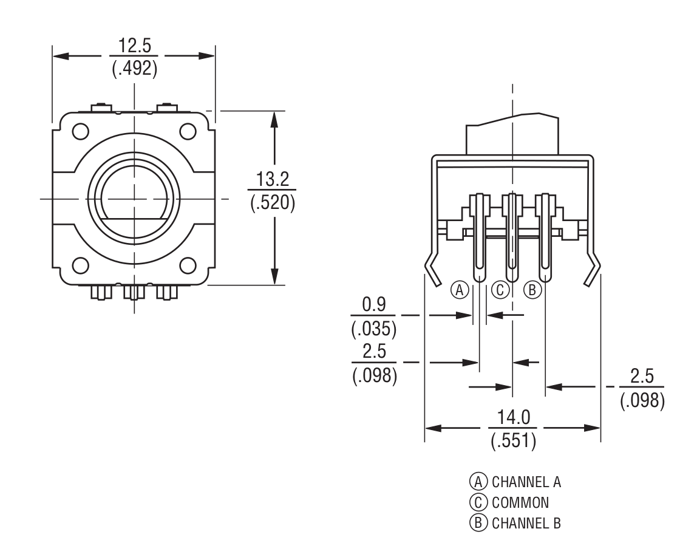

This is a device driver library for the RP2040 to read a rotary encoder,
e.g. <https://www.adafruit.com/product/377>

# Wiring

If the side with the three pins is facing you, with the shaft up, then
the pins are A, C, B.



```
Pico GPIO | Pico Pin | Knob pin
----------+----------+--------------------------
GPIO 0    | 1        | A
GND       | 3        | C (center on 3-pin side)
GPIO 1    | 2        | B
----------+----------+--------------------------
GND       | 38       | either pin on 2-pin side
GPIO 2    | 4        | other pin on 2-pin side
----------+----------+--------------------------
```
